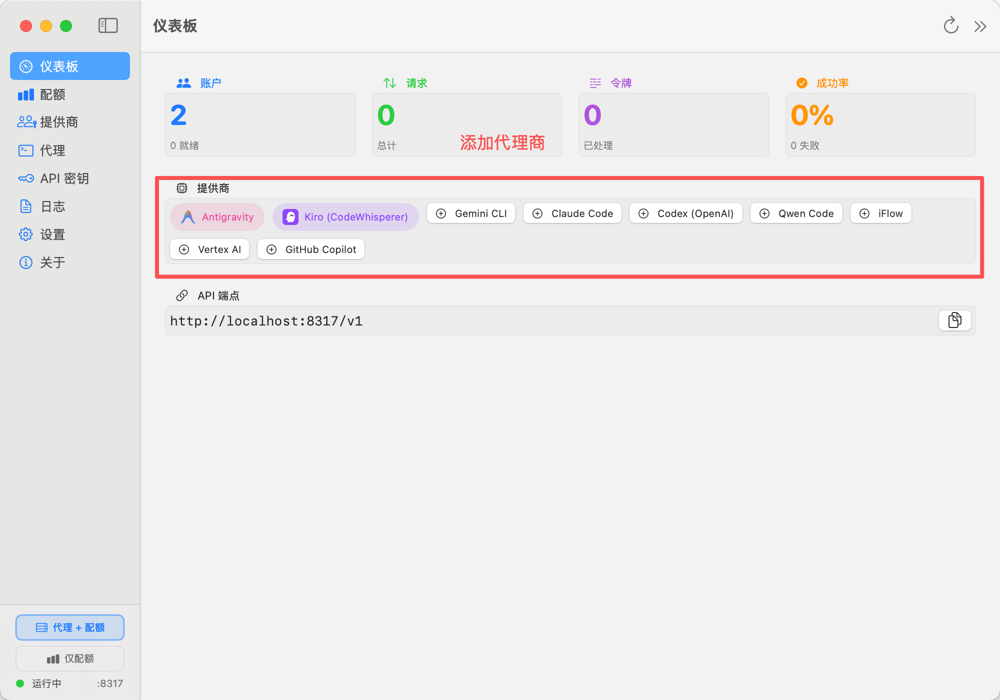
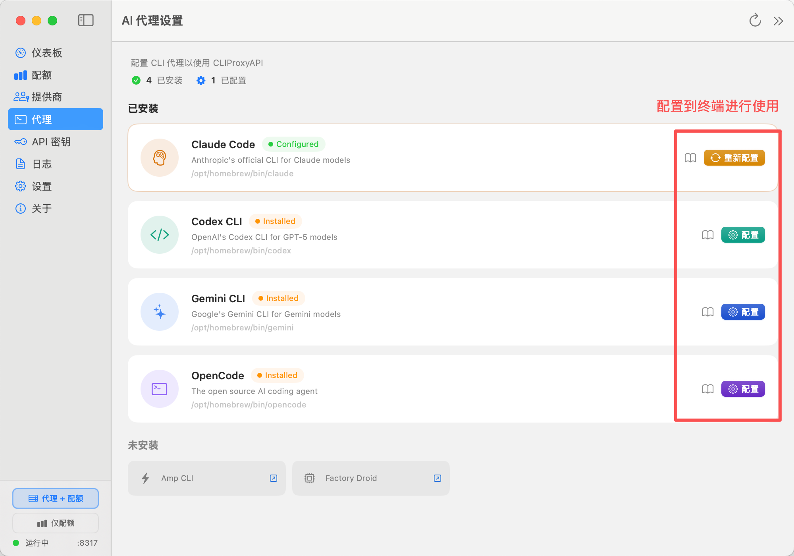

### 编辑器内部使用的用量查询工具

 vscode 插件 [Antigravity Quota Watcher](https://github.com/wusimpl/AntigravityQuotaWatcher)
### AI 编程工具聚合代理及用量显示

[quotio](https://github.com/nguyenphutrong/quotio) 除了支持 反重力编辑器外，还提供直接作为 api 模型的代理的能力

#### 添加提供商


#### 配置到其他编程工具


### Antigravity 反重力编辑器报错

和依赖安装无关，编辑器本身的问题（当前版本1.13.3）

``` js
Error in svelte.config.js  
  
Error: Cannot find module @rollup/rollup-darwin-arm64. npm has a bug related to optional dependencies (https://github.com/npm/cli/issues/4828). Please try `npm i` again after removing both package-lock.json and node_modules directory.svelte
```

 解决 `.vscode/settings.json`:
 
```
{
	"svelte.language-server.runtime": "node", // 修复 Antigravity Svelte 编辑器报错
	"svelte.plugin.svelte.compilerWarnings": {
		"a11y-media-has-caption": "ignore"
	}
}
```

> 来源：https://github.com/sveltejs/language-tools/issues/2890#issuecomment-3561330313